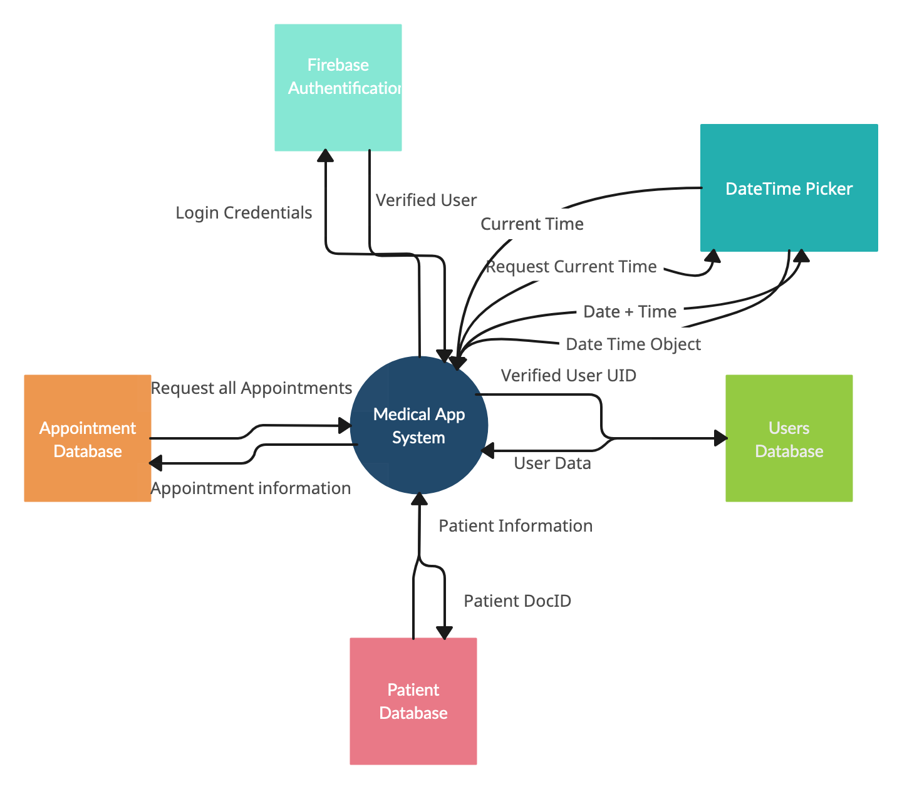
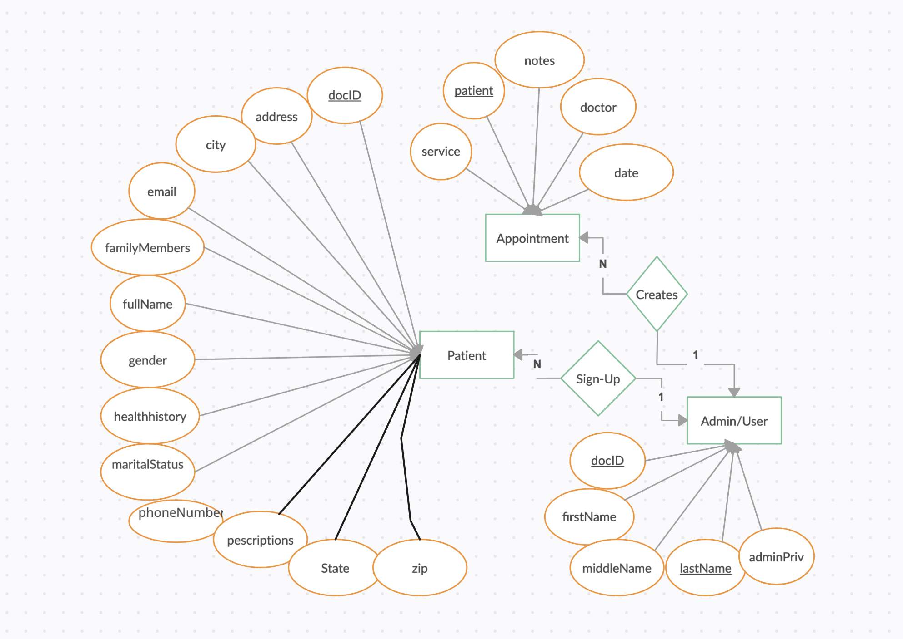

# Recyclable Team 

HairDoneWright530 is located in Olivehurst, California and is privately owned by 
Melissa Wright. The HairDoneWright530 app is designed to connect Melissa with her clients and the clients to Melissa by providing an easy to use User Interface (UI) for use in the app. This app will help drive business to HairDoneWright530 by providing to the community a state licensed cosmetologists’s services in one application. The Administrator side of the app allows for booking appointments and changing of appointments, selection of clienttell, integrated schedule setting, customized notes and information for contacting clients, and for clients they can book and see available times Melissa has for appointments while also providing a convenient, and easy to use selection of available services. 

This project is being completed by a team from Sacramento State University called the Recycling Team as part of a Senior Project over the time span of 2 semesters.

# Table of Contents
- [Authors](#authors)
- [Project Scope](#project-scope)
- [Installation](#installation)
  - [Setting up Simulators](#setting-up-the-simulators)
    - [Android Simulator](#android-simulator)
    - [IOS Simulator](#ios-simulator)
- [Running the Program](#running-the-program)
- [Testing](#testing)
- [Deployment](#deployment)
  - [Android Instructions](#android-deployment)
  - [IOS Deployment](#ios-deployment)

## Authors

- [@Adrian Gonzalez](https://github.com/VoicelessBark44) - Github
- [@Wilson Toy](https://github.com/Wilson-Toy) - Github
- [@Shonali Kumar](https://github.com/nalisonia) - GitHub
- [@Bryant Galo](https://github.com/BryantG89) - GitHub
- [@Raz Mohammad Ibrahimi](https://github.com/razibrahimi) - GitHub
- [@Jesse Quach](https://github.com/leviathanQ) - GitHub

## Project Scope



Relational Mapping for the Database:



## Installation

To install and run the project on your computer you will need to first clone the project on your local machine in the manor you wish either by downloading the source code or by using the provided command below. 

```bash
git clone https://github.com/VoicelessBark44/RecycableTeam
```

In addition to the listed dependencies below you will need npm and to create a expo app to run the app in.

```bash
npm install @react-navigation/native
npm install @react-navigation/native-stack
npx expo install expo-router react-native-safe-area-context react-native-screens expo-linking expo-constants expo-status-bar
npx expo install react-native-gesture-handler react-native-reanimated
npm install react-native-dropdown-select-list
npm install firebase
npm install react-native-datepicker --save
npm install @react-native-community/datetimepicker --save
```

## Setting up the Simulators

In order to run the project and properly test it, you will have to have a simulator available for expo to run the react native app on. There are many choices how you go about this, but my team used and tested on 2 different methods; IOS Simulator and Android.

### Android Simulator

The android simulator takes a bit more work to get running than the ios simulator but it has a lot of options for how you go about running the app on the simulator. Firrst you will need to download and install [Android Studio](https://developer.android.com/studio/install). Android Studio as of writing this section (5/1/24) runs on Windows, Some distros of Linux (Ubuntu), Mac OS, and Chrome OS. 

After downloading and installing Android Studio you will need to install a device to simulate Android on. The app should be fine for most versions of android devices such as Pixel phones. 

When launching the development server you will need to activate the simulator first and then click 'a' in the terminal for development server so that it starts launching the expo app on the andoid simulator.

### IOS Simulator

In order to run the IOS simualtor you will need either a IOS device or a Mac capable of running the IOS simulator (Most modernish Macs should be able to). The next step after securing a mac would be to go to the App Store and download [X-Code](https://apps.apple.com/us/app/xcode/id497799835?mt=12). 

Once in X-Code you will need to go to the settings page and from there platforms where you can select the version number and what kind of device you would like to simulate on. Then download the platform/device. You can either go to your simulators (Will appear in your application from now on) or when launching the development server just click 'i' to load the app in the simulator and it should automatically activate and load the app into the simulator.


## Running the Program

To deploy this project type in the terminal:

```bash
npm run
```
Or you can type:

```bash
npx expo start
```
Both of these commands should start the project and bring you to wall of text with a QR code that you can scan to run the app on your phone. We recommend you use 'npx expo start'. If you don't want to run this project on your phone using the QR code you can download a simulator and run it locally.

## Testing

Testing can be done either manually or through semi-auto - to fully automatic testing. Our Development team performed testing mostly through manual testing of the different pages but some testing was done by using a dependency called Jest. You can install Jest by going to the terminal and pasting this command in:

```bash
npm install --save-dev jest
```

There are many ways to use Jest withing the confines of the project. The base version of Jest however, cannot work with react native or TypeScript so extra dependencies will need to be installed. With some manual work in the configs of the project. We will provide the following command for the different dependencies but you should go the Jest website and follow their instructions because it may have changed by the time you are working on this project. 

React Native:
```bash
npm install --save-dev jest @testing-library/react-native react-native-testing-library
```

For [TypeScript](https://jestjs.io/docs/getting-started):
```bash
npm install --save-dev @types/jest
```

In order to run tests on various functions you will to make a file that ends with .test as Jest will know to run the tests on files that end with it.

Jest will after running the following command:

```bash
npm test
```

Will automatically run tests on all files that have .test in it.

## Deployment

### Android Deployment

There are several ways to deploy to the Google Play store for Android. This will explain the steps we used to deploy to the Google Play Store.

Expo uses a client called [EAS](https://expo.dev/eas) which requires an account to use. Next you will need to open up and connect your Android simulator. Next you will need to open up your terminal and install the EAS Client by running this command:

```bash
npm install -g eas-cli
```

Next you will need to create an `eas.json` file in the root folder of the project. Which should contain the following code:

```json
{
  "build": {
    "production":{}
  },
  "cli": {
    "requireCommit":true
  }
}
```

The next step is to choose which platform to build the app for. We wil be choosing Android for this specific tutorial so the user will need to enter the following command into the Terminal:

```bash
eas build --platform android
```

This should if there aren't any error create an APK that can be used to submit to the Google Play Store or just run locally. If there are errors the following instructions will help you diagnose and deal with them.

You should make another Github branch for the work you are about to do. In order to help find errors you will run the following command:

```bash
npx expo prebuild
```
or
```bash
npx expo prebuild --platform android
```

This should create an android folder using the app.json file from expo. From here you can explore and experiment with the different potential errors you are getting within the confines of a pre-build. If you would like to test the pre-build locally you can run the following command:

```bash
eas build --platform android --local
```

If you are using a Mac or Linux you can use:

```bash
npx expo run::android
```
*For testing, you will need to add an additional file called `local.properties` and add the location of your android SDK*

*For Windows Users the default location is:*

`sdk.dir=C\:\\Users\\USERNAME\\AppData\\Local\\Android\\sdk`

*For Mac OS users:*

`sdk.dir = /Users/USERNAME/Library/Android/sdk`

*For Linux Users:*

`sdk.dir = /home/USERNAME/Android/Sdk`

Finally to submit to the Google Play Store you will need to sign in with your developer account and click on the **App Bundle Explorer** to see the lost of AABs. Once clicked there should be a button called **Upload new version** which you can use to creae a new release or to update the app. 
### IOS Deployment

There are several ways to deploy to the Apple App Store for IOS. This will explain the steps we used to deploy to the Apple App Store.

Expo uses a client called [EAS](https://expo.dev/eas) which requires an account to use. Next you will need to open up and connect your Android simulator. Next you will need to open up your terminal and install the EAS Client by running this command:

```bash
npm install -g eas-cli
```

Next you will need to create an `eas.json` file in the root folder of the project. Which should contain the following code:

```json
{
  "build": {
    "production":{}
  },
  "cli": {
    "requireCommit":true
  }
}
```

The next step is to choose which platform to build the app for. We wil be choosing IOS for this specific tutorial so the user will need to enter the following command into the Terminal:

```bash
eas build --platform ios
```

This should if there aren't any error create an IPA that can be used to submit to the Apple App Store or just run locally. If there are errors the following instructions will help you diagnose and deal with them.

You should make another Github branch for the work you are about to do. In order to help find errors you will run the following command:

```bash
npx expo prebuild --platform ios
```

This should create an ios folder using the app.josn file from expo.

For some Macs you may get an error and it can be a multitude of errors. These are ones we encountered and how to fix them:

If you need ot update/install cocoa pods, it should give you a command using gem. If sudo isn't working, use the command:

```bash
gem install cocoapods --user-install
```

Next it may say that Pods do not exist in which case you will need to move your current working directory to the ios directory and run the command:

```bash
Pods install
```

After the successful IPA build that is generated you will login into the Apple App Store with your developer account and submit the new IPA build for review and deployment to your app. 